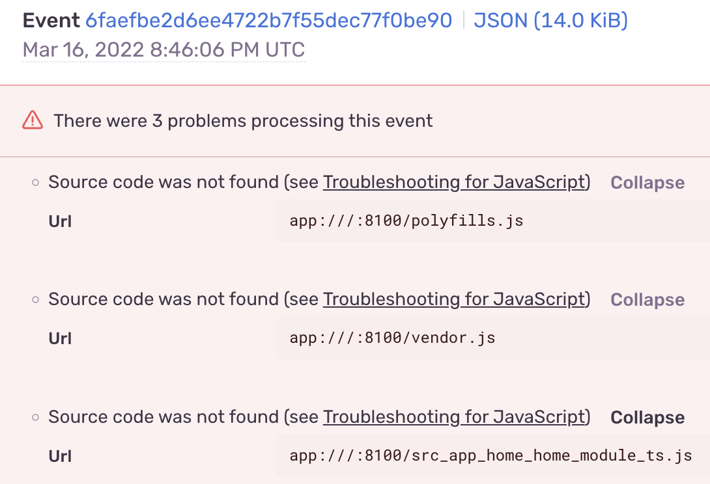
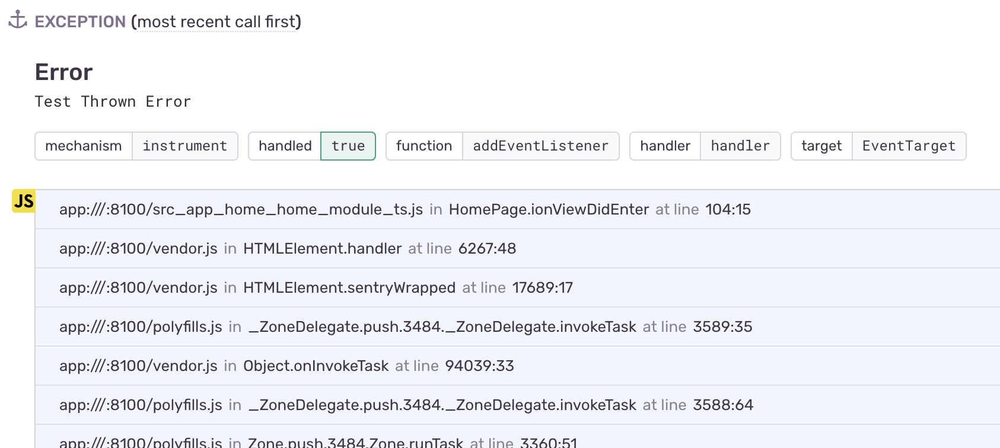
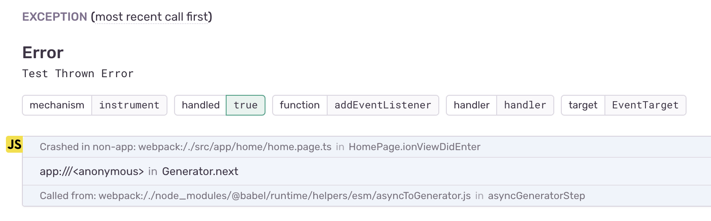
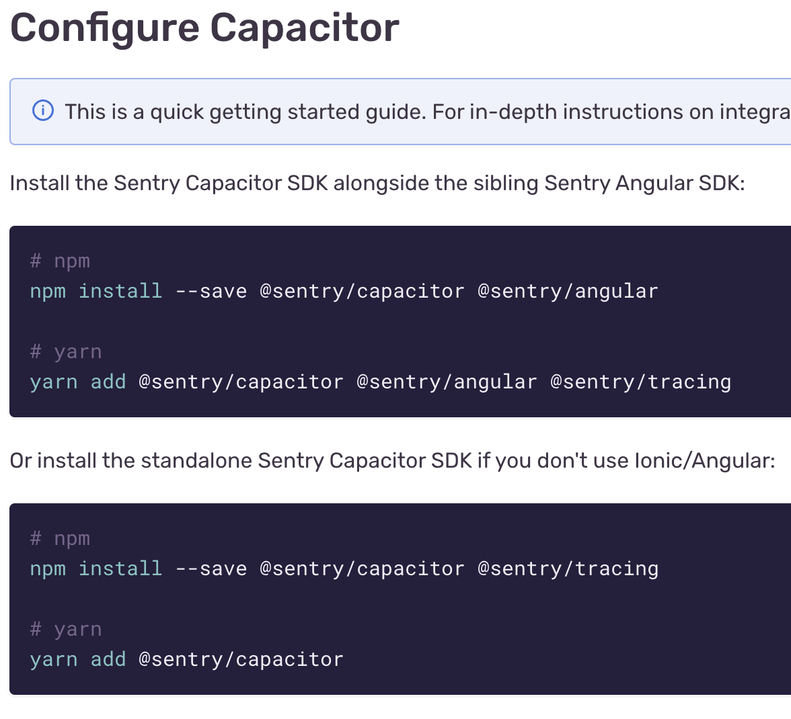

# Sample App Demonstrating Sentry Sourcemapping Issue
This app was created to aid in a github issue, where some of us are struggling to get sourcemapping to work in Sentry with Ionic/Capacitor applications.

## Sentry Setup
Created an account, organization, and Capacitor project in Sentry.

## Ionic Setup
 1. Created a blank Ionic (v6) + Angular (v13) + Capacitor (v3) app using the Ionic CLI (`ionic start`)
 2. Installed Sentry packages
    ```bash
    npm install --save @sentry/capacitor @sentry/angular
    ```
 3. Followed Capacitor setup [docs](https://docs.sentry.io/platforms/javascript/guides/capacitor/#configure)
    - I put `Sentry.init()` in main.ts instead of app.module.ts
    - Configured a dsn (removed from this example), release, and dist. Substitue your own values to test for yourself
 4. Threw an error in the `ionViewDidEnter` lifecycle in `src/app/home/home.page.ts` for Sentry to log.
 5. Did a development build of app `ionic build` to generate the `www` directory

## Sentry Release
 1. Created a release
    ```bash
    sentry-cli releases new sentry-sourcemaps-issue@0.0.1
    ```
 2. Uploaded minified files and sourcemaps for dist
    ```bash
    sentry-cli releases files sentry-sourcemaps-issue@0.0.1 upload-sourcemaps ./www --dist 1
    ```
 3. Finalized release
    ```bash
    sentry-cli releases finalize sentry-sourcemaps-issue@0.0.1
    ```

## Launch Ionic App
 - Ran `ionic serve` to run app locally and trigger the error

## Sentry Event
 - Sentry did successfully receive the event
 - Breadcrumbs and Tags look fine
 - **The Problem** "Source code was not found" (see my [event](https://sentry.io/organizations/jamesontaylor/issues/3108472946/events/6faefbe2d6ee4722b7f55dec77f0be90/?project=6262714))
    <div>
      
    </div>

## Questions
 - Is serving the app using `ionic serve` not supported or requires special configuration over a "deployed" app?
    - Using `http-server` to serve up the `www` directory locally does **not** show "problems" in Sentry but has an entirely different stack trace
        - `ionic serve` stack trace
          <div>
            
          </div>
        - `http-server ./www` stack trace
          <div>
            
          </div>
 - Is `@sentry/tracing` required for error logging to work? The quickstart guide is confusing as some examples include the package and others don't, but my impression is that Tracing is only needed for performance logging.
    <div>
      
    </div>